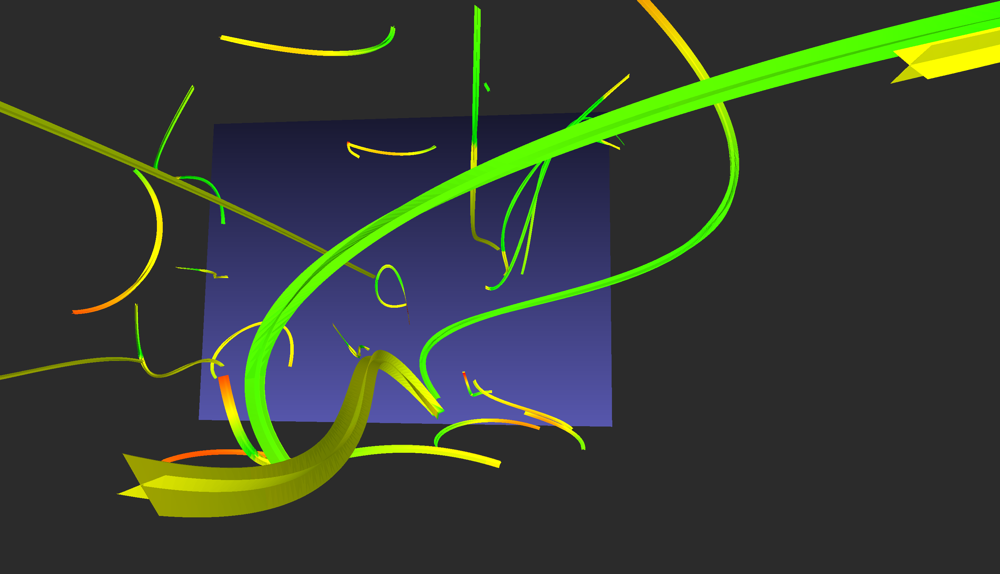

<b>Usage</b>

1 - Prepare the workdir with `./run.sh`, or set up a box mesh yourself (explained in run.sh)

2 - Set up the field by editing  `scripts/StreamlineAux.py`, or write yourself a plugin to consume an external `.csv`

3 - Generate N streamlines by running `python3 scripts/Streamline.py N`

<b>Example 1</b>

Given the following almost linear field

Results visualized in [Meshlab](https://www.meshlab.net/) are

<b>Example 2</b>

Given the following almost 'whirly' field

Results visualized in [Meshlab](https://www.meshlab.net/) are

